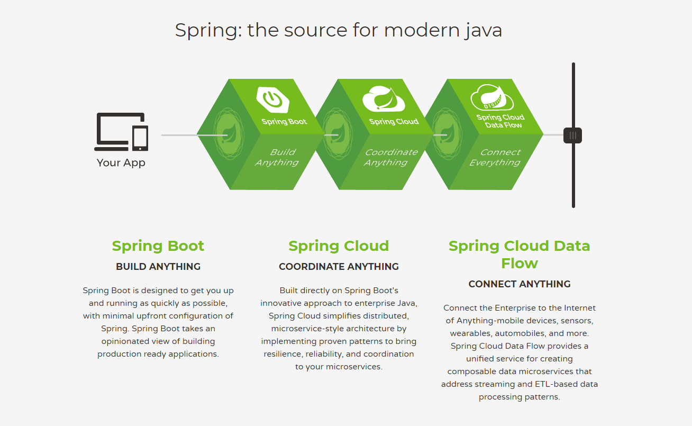
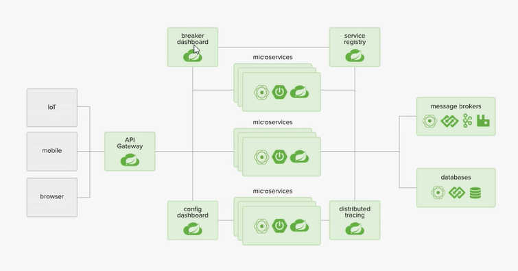
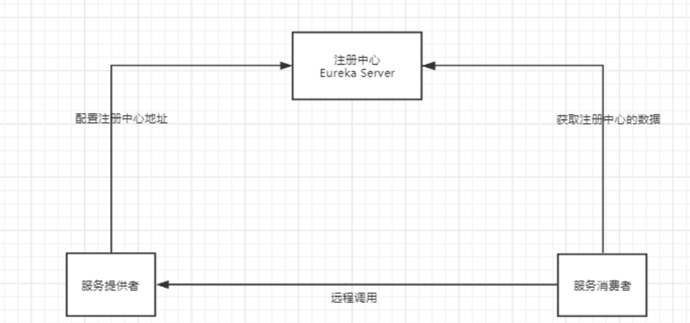
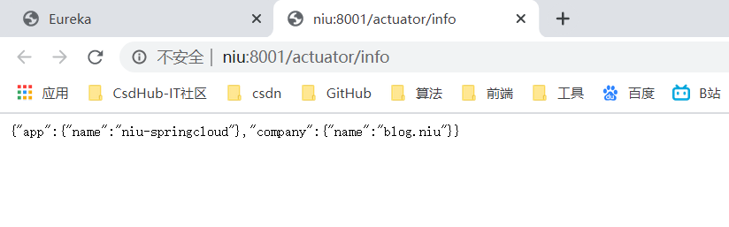

### 1. 学习前言

#### 1.1 内容概述

> 学习前提：

- JavaSE
- 数据库
- 前端
- Servlet
- Http
- Mybatis + Spring + SpringMVC
- Springboot
- Dubbo + Zookeeper + 分布式基础
- Maven + Git
- Ajax + Json
- …

> 这个阶段如何学习?

```reStructuredText
三层架构 + MVC
框架：
    Spring(轻量级的Java开源框架)：解决企业开发的复杂性    IOC、AOP    
    SpringBoot(Spring的升级版)：新一代的JavaEE开发标准 自动装配
    模块化~    all in one
    模块化的开发===all in one 代码没发生变
微服务架构4个核心问题:
    1. 服务很多,客户端怎么访问?
    2. 这么多服务,服务之间如何通信?
    3. 这么多服务,如何治理?
    4. 服务挂了怎么办?
解决方案选型:
    SpringCloud 是一种生态！    学习前提已经会使用Springboot,有分布式基础,了解Dubbo+ZooKeeper
    1. Spring Cloud NetFlix(已经停止维护)：一站式解决方案！可解决上述4个核心问题
        API网关：zuul组件
        通信：Feign ---- HttpClient ---- Http通信方式,同步,阻塞
        服务注册和发现：Eureka
        熔断机制：Hystrix
        ......
    2. Apache Dubbo Zookeeper：半自动！需要整合别人的
        API网关：没有,找第三方组件(比如整合zull组件),或者自己实现
        通信：Dubbo 是一个基于Java的高性能的RPC通信框架(性能比Feign强大)
        服务注册和发现：Zookeeper
        熔断机制：没有,需要借助Hystrix
    3. Spring Cloud Alibaba：目前最新的一站式解决方案！可解决上述4个核心问题,更简单
        API网关：
        通信：
        服务注册和发现：
        熔断机制：
新概念：服务网格~ Server Mesh
    istio
万变不离其宗4个问题：
    1. API网关
    2. HTTP,RPC通信
    3. 注册和发现
    4. 熔断机制
```

#### 1.2 常见面试题

1.1 什么是微服务？

1.2 微服务之间是如何独立通讯的？

1.3 SpringCloud 和 Dubbo有那些区别？

1.4 SpringBoot 和 SpringCloud，请谈谈你对他们的理解

1.5 什么是服务熔断？什么是服务降级？

1.6 微服务的优缺点分别是什么？说下你在项目开发中遇到的坑

1.7 你所知道的微服务技术栈有哪些？列举一二

1.8 Eureka和Zookeeper都可以提供服务注册与发现的功能，请说说两者的区别

…

### 2. 微服务概述

#### 2.1 什么是微服务？

**什么是微服务？**微服务(Microservice Architecture) 是近几年流行的一种架构思想，关于它的概念很难一言以蔽之。

究竟什么是微服务呢？我们在此引用ThoughtWorks 公司的首席科学家 Martin Fowler 于2014年提出的一段话：

原文：https://martinfowler.com/articles/microservices.html

汉化：https://www.cnblogs.com/liuning8023/p/4493156.html

- 就目前而言，对于微服务，业界并没有一个统一的，标准的定义。
- 但通常而言，微服务架构是一种架构模式，或者说是一种架构风格，**它体长将单一的应用程序划分成一组小的服务**，每个服务运行在其独立的自己的进程内，服务之间互相协调，互相配置，为用户提供最终价值，服务之间采用轻量级的通信机制(**HTTP**)互相沟通，每个服务都围绕着具体的业务进行构建，并且能狗被独立的部署到生产环境中，另外，应尽量避免统一的，集中式的服务管理机制，对具体的一个服务而言，应该根据业务上下文，选择合适的语言，工具(**Maven**)对其进行构建，可以有一个非常轻量级的集中式管理来协调这些服务，可以使用不同的语言来编写服务，也可以使用不同的数据存储。

**再来从技术维度角度理解下：**

- 微服务化的核心就是将传统的一站式应用，根据业务拆分成一个一个的服务，彻底地去耦合，每一个微服务提供单个业务功能的服务，一个服务做一件事情，从技术角度看就是一种小而独立的处理过程，类似进程的概念，能够自行单独启动或销毁，拥有自己独立的数据库。

#### 2.2 微服务与微服务架构

**微服务**

强调的是服务的大小，它关注的是某一个点，是具体解决某一个问题/提供落地对应服务的一个服务应用，狭义的看，可以看作是IDEA中的一个个微服务工程，或者Moudel。

```
IDEA 工具里面使用Maven开发的一个个独立的小Moudel，它具体是使用SpringBoot开发的一个小模块，专业的事情交给专业的模块来做，一个模块就做着一件事情。强调的是一个个的个体，每个个体完成一个具体的任务或者功能。
```

**微服务架构**

一种新的架构形式，Martin Fowler 于2014年提出。

微服务架构是一种架构模式，它体长将单一应用程序划分成一组小的服务，服务之间相互协调，互相配合，为用户提供最终价值。每个服务运行在其独立的进程中，服务与服务之间采用轻量级的通信机制**(如HTTP)**互相协作，每个服务都围绕着具体的业务进行构建，并且能够被独立的部署到生产环境中，另外，应尽量避免统一的，集中式的服务管理机制，对具体的一个服务而言，应根据业务上下文，选择合适的语言、工具**(如Maven)**对其进行构建。

#### 2.3 微服务优缺点

**优点**

- 单一职责原则；
- 每个服务足够内聚，足够小，代码容易理解，这样能聚焦一个指定的业务功能或业务需求；
- 开发简单，开发效率高，一个服务可能就是专一的只干一件事；
- 微服务能够被小团队单独开发，这个团队只需2-5个开发人员组成；
- 微服务是松耦合的，是有功能意义的服务，无论是在开发阶段或部署阶段都是独立的；
- 微服务能使用不同的语言开发；
- 易于和第三方集成，微服务允许容易且灵活的方式集成自动部署，通过持续集成工具，如jenkins，Hudson，bamboo；
- 微服务易于被一个开发人员理解，修改和维护，这样小团队能够更关注自己的工作成果，无需通过合作才能体现价值；
- 微服务允许利用和融合最新技术；
- **微服务只是业务逻辑的代码，不会和HTML，CSS，或其他的界面混合;**
- **每个微服务都有自己的存储能力，可以有自己的数据库，也可以有统一的数据库；**

**缺点**

- 开发人员要处理分布式系统的复杂性；
- 多服务运维难度，随着服务的增加，运维的压力也在增大；
- 系统部署依赖问题；
- 服务间通信成本问题；
- 数据一致性问题；
- 系统集成测试问题；
- 性能和监控问题；

#### 2.4 微服务技术栈有那些？

| **微服务技术条目**                     | 落地技术                                                     |
| :------------------------------------- | :----------------------------------------------------------- |
| 服务开发                               | SpringBoot、Spring、SpringMVC等                              |
| 服务配置与管理                         | Netfix公司的Archaius、阿里的Diamond等                        |
| 服务注册与发现                         | Eureka、Consul、Zookeeper等                                  |
| 服务调用                               | Rest、PRC、gRPC                                              |
| 服务熔断器                             | Hystrix、Envoy等                                             |
| 负载均衡                               | Ribbon、Nginx等                                              |
| 服务接口调用(客户端调用服务的简化工具) | Fegin等                                                      |
| 消息队列                               | Kafka、RabbitMQ、ActiveMQ等                                  |
| 服务配置中心管理                       | SpringCloudConfig、Chef等                                    |
| 服务路由(API网关)                      | Zuul等                                                       |
| 服务监控                               | Zabbix、Nagios、Metrics、Specatator等                        |
| 全链路追踪                             | Zipkin、Brave、Dapper等                                      |
| 数据流操作开发包                       | SpringCloud Stream(封装与Redis，Rabbit，Kafka等发送接收消息) |
| 时间消息总栈                           | SpringCloud Bus                                              |
| 服务部署                               | Docker、OpenStack、Kubernetes等                              |

#### 2.5 为什么选择SpringCloud作为微服务架构

1. 选型依据
   - 整体解决方案和框架成熟度
   - 社区热度
   - 可维护性
   - 学习曲线

1. 当前各大IT公司用的微服务架构有那些？

   - 阿里：dubbo+HFS

   - 京东：JFS

   - 新浪：Motan

   - 当当网：DubboX

     …

1. 各微服务框架对比

| **功能点/服务框架** | Netflix/SpringCloud                                          | Motan                                                       | gRPC                      | Thrift   | Dubbo/DubboX                        |
| :------------------ | :----------------------------------------------------------- | :---------------------------------------------------------- | :------------------------ | :------- | :---------------------------------- |
| 功能定位            | 完整的微服务框架                                             | RPC框架，但整合了ZK或Consul，实现集群环境的基本服务注册发现 | RPC框架                   | RPC框架  | 服务框架                            |
| 支持Rest            | 是，Ribbon支持多种可拔插的序列号选择                         | 否                                                          | 否                        | 否       | 否                                  |
| 支持RPC             | 否                                                           | 是(Hession2)                                                | 是                        | 是       | 是                                  |
| 支持多语言          | 是(Rest形式)                                                 | 否                                                          | 是                        | 是       | 否                                  |
| 负载均衡            | 是(服务端zuul+客户端Ribbon)，zuul-服务，动态路由，云端负载均衡Eureka（针对中间层服务器） | 是(客户端)                                                  | 否                        | 否       | 是(客户端)                          |
| 配置服务            | Netfix Archaius，Spring Cloud Config Server 集中配置         | 是(Zookeeper提供)                                           | 否                        | 否       | 否                                  |
| 服务调用链监控      | 是(zuul)，zuul提供边缘服务，API网关                          | 否                                                          | 否                        | 否       | 否                                  |
| 高可用/容错         | 是(服务端Hystrix+客户端Ribbon)                               | 是(客户端)                                                  | 否                        | 否       | 是(客户端)                          |
| 典型应用案例        | Netflix                                                      | Sina                                                        | Google                    | Facebook |                                     |
| 社区活跃程度        | 高                                                           | 一般                                                        | 高                        | 一般     | 2017年后重新开始维护，之前中断了5年 |
| 学习难度            | 中等                                                         | 低                                                          | 高                        | 高       | 低                                  |
| 文档丰富程度        | 高                                                           | 一般                                                        | 一般                      | 一般     | 高                                  |
| 其他                | Spring Cloud Bus为我们的应用程序带来了更多管理端点           | 支持降级                                                    | Netflix内部在开发集成gRPC | IDL定义  | 实践的公司比较多                    |

### 3. SpringCloud入门概述

#### 3.1 SpringCloud是什么？

Spring官网：https://spring.io/





Spring Cloud provides tools for developers to quickly build some of the common patterns in distributed systems (e.g. configuration management, service discovery, circuit breakers, intelligent routing, micro-proxy, control bus, one-time tokens, global locks, leadership election, distributed sessions, cluster state). Coordination of distributed systems leads to boiler plate patterns, and using Spring Cloud developers can quickly stand up services and applications that implement those patterns. They will work well in any distributed environment, including the developer’s own laptop, bare metal data centres, and managed platforms such as Cloud Foundry.

翻译：

Spring Cloud为开发人员提供了快速构建分布式系统中的一些常见模式的工具(例如配置管理、服务发现、断路器、智能路由、微代理、控制总线、一次性令牌、全局锁、领导人选举、分布式会话、集群状态)。分布式系统的协调导致了锅炉板模式，而使用Spring Cloud开发人员可以快速建立实现这些模式的服务和应用程序。它们在任何分布式环境中都能很好地工作，包括开发人员自己的笔记本电脑、裸金属数据中心和云计算等托管平台。

#### 3.2 SpringCloud和SpringBoot的关系

- SpringBoot专注于开苏方便的开发单个个体微服务；
- SpringCloud是关注全局的微服务协调整理治理框架，它将SpringBoot开发的一个个单体微服务，整合并管理起来，为各个微服务之间提供：配置管理、服务发现、断路器、路由、为代理、事件总栈、全局锁、决策竞选、分布式会话等等集成服务；
- SpringBoot可以离开SpringCloud独立使用，开发项目，但SpringCloud离不开SpringBoot，属于依赖关系；
- **SpringBoot专注于快速、方便的开发单个个体微服务，SpringCloud关注全局的服务治理框架；

#### 3.3 Dubbo 和 SpringCloud技术选型

##### 1. 分布式+服务治理Dubbo

目前成熟的互联网架构，应用服务化拆分+消息中间件

##### 2. Dubbo 和 SpringCloud对比

可以看一下社区活跃度：

https://github.com/dubbo

https://github.com/spring-cloud

**对比结果：**

|              | Dubbo         | SpringCloud                  |
| ------------ | ------------- | ---------------------------- |
| 服务注册中心 | Zookeeper     | Spring Cloud Netfilx Eureka  |
| 服务调用方式 | RPC           | REST API                     |
| 服务监控     | Dubbo-monitor | Spring Boot Admin            |
| 断路器       | 不完善        | Spring Cloud Netfilx Hystrix |
| 服务网关     | 无            | Spring Cloud Netfilx Zuul    |
| 分布式配置   | 无            | Spring Cloud Config          |
| 服务跟踪     | 无            | Spring Cloud Sleuth          |
| 消息总栈     | 无            | Spring Cloud Bus             |
| 数据流       | 无            | Spring Cloud Stream          |
| 批量任务     | 无            | Spring Cloud Task            |

**最大区别：Spring Cloud 抛弃了Dubbo的RPC通信，采用的是基于HTTP的REST方式**

严格来说，这两种方式各有优劣。虽然从一定程度上来说，后者牺牲了服务调用的性能，但也避免了上面提到的原生RPC带来的问题。而且REST相比RPC更为灵活，服务提供方和调用方的依赖只依靠一纸契约，不存在代码级别的强依赖，这个优点在当下强调快速演化的微服务环境下，显得更加合适。

**品牌机和组装机的区别**

很明显，Spring Cloud的功能比DUBBO更加强大，涵盖面更广,而且作为Spring的拳头项目，它也能够与SpringFramework、Spring Boot、Spring Data、Spring Batch等其他Spring项目完美融合,这些对于微服务而言是至关重要的。使用Dubbo构建的微服务架构就像组装电脑，各环节我们的选择自由度很高，但是最终结果很有可能因为一条内存质量不行就点不亮了，总是让人不怎么放心，但是如果你是一名高手， 那这些都不是问题;而SpringCloud就像品牌机，在Spring Source的整合下，做了大量的兼容性测试，保证了机器拥有更高的稳定性,但是如果要在使用非原装组件外的东西，就需要对其基础有足够的了解。

**社区支持与更新力度的区别**

最为重要的是，DUBBO停止了5年左右的更新，虽然2017.7重启了。对于技术发展的新需求，需要由开发者自行拓展升级(比如当当网弄出了DubboX)，这对于很多想要采用微服务架构的中小软件组织，显然是不太合适的,中小公司没有这么强大的技术能力去修改Dubbo源码+周边的一整套解决方案,并不是每-一个公司都有阿里的大牛+真实的线上生产环境测试过。

**总结：**

 **二者解决的问题域不一样：Dubbo的定位是一款RPC框架，而SpringCloud的目标是微服务架构下的一站式解决方案。**

#### 3.4 SpringCloud能干嘛？

- Distributed/versioned configuration 分布式/版本控制配置
- Service registration and discovery 服务注册与发现
- Routing 路由
- Service-to-service calls 服务到服务的调用
- Load balancing 负载均衡配置
- Circuit Breakers 断路器
- Distributed messaging 分布式消息管理
- …

#### 3.5 SpringCloud下载

官网：http://projects.spring.io/spring-cloud/

版本号有点特别：


SpringCloud没有采用数字编号的方式命名版本号，而是采用了伦敦地铁站的名称，**同时根据字母表的顺序来对应版本时间顺序**，比如最早的Realse版本：Angel，第二个Realse版本：Brixton，然后是Camden、Dalston、Edgware，目前最新的是Hoxton SR4 CURRENT GA通用稳定版。

**自学参考书：**

- SpringCloud Netflix 中文文档：https://springcloud.cc/spring-cloud-netflix.html
- SpringCloud 中文API文档(官方文档翻译版)：https://springcloud.cc/spring-cloud-dalston.html
- SpringCloud中国社区：http://springcloud.cn/
- SpringCloud中文网：https://springcloud.cc

### 4. SpringCloud Rest学习环境搭建：服务提供者

项目总体架构

父pom.XML

```xml
<?xml version="1.0" encoding="UTF-8"?>
<project xmlns="http://maven.apache.org/POM/4.0.0"
         xmlns:xsi="http://www.w3.org/2001/XMLSchema-instance"
         xsi:schemaLocation="http://maven.apache.org/POM/4.0.0 http://maven.apache.org/xsd/maven-4.0.0.xsd">
    <modelVersion>4.0.0</modelVersion>

    <groupId>com.niu</groupId>
    <artifactId>springcloud</artifactId>
    <version>1.0-SNAPSHOT</version>
    <modules>
        <module>springcloudapi</module>
        <module>springcloud-provider-dept-8001</module>
        <module>springcould-consumer-dept-80</module>
    </modules>
    <!--打包方式 pom-->
    <packaging>pom</packaging>
    <properties>
        <project.build.sourceEncoding>UTF-8</project.build.sourceEncoding>
        <maven.compiler.source>1.8</maven.compiler.source>
        <maven.compiler.target>1.8</maven.compiler.target>
        <junit.version>4.12</junit.version>
    </properties>
    <dependencyManagement>
        <dependencies>
            <!-- https://mvnrepository.com/artifact/org.springframework.cloud/spring-cloud-dependencies -->
            <dependency>
                <groupId>org.springframework.cloud</groupId>
                <artifactId>spring-cloud-dependencies</artifactId>
                <version>Greenwich.SR1</version>
                <type>pom</type>
                <scope>import</scope>
            </dependency>
            <dependency>
                <groupId>org.springframework.boot</groupId>
                <artifactId>spring-boot-dependencies</artifactId>
                <version>2.3.3.RELEASE</version>
                <type>pom</type>
                <scope>import</scope>
            </dependency>
            <dependency>
                <groupId>mysql</groupId>
                <artifactId>mysql-connector-java</artifactId>
                <version>8.0.21</version>
            </dependency>
            <dependency>
                <groupId>com.alibaba</groupId>
                <artifactId>druid</artifactId>
                <version>1.1.21</version>
            </dependency>
            <!--springboot启动器-->
            <dependency>
                <groupId>org.mybatis.spring.boot</groupId>
                <artifactId>mybatis-spring-boot-starter</artifactId>
                <version>2.1.3</version>
            </dependency>
            <!--日志测试~-->
            <dependency>
                <groupId>ch.qos.logback</groupId>
                <artifactId>logback-classic</artifactId>
                <version>1.2.3</version>
            </dependency>
            <dependency>
                <groupId>ch.qos.logback</groupId>
                <artifactId>logback-core</artifactId>
                <version>RELEASE</version>
            </dependency>

            <!--lo4j-->
            <dependency>
                <groupId>junit</groupId>
                <artifactId>junit</artifactId>
                <version>${junit.version}</version>
            </dependency>
            <dependency>
                <groupId>org.projectlombok</groupId>
                <artifactId>lombok</artifactId>
                <version>1.18.12</version>
            </dependency>
            <dependency>
                <groupId>ch.qos.logback</groupId>
                <artifactId>logback-classic</artifactId>
                <version>1.2.3</version>
            </dependency>
            <dependency>
                <groupId>ch.qos.logback</groupId>
                <artifactId>logback-classic</artifactId>
                <version>1.2.3</version>
                <exclusions>
                    <exclusion>
                        <groupId>org.slf4j</groupId>
                        <artifactId>slf4j-log4j12</artifactId>
                    </exclusion>
                </exclusions>
            </dependency>
        </dependencies>
    </dependencyManagement>
</project>
```

#### **springcloudapi**

```java
import lombok.Data;
import lombok.NoArgsConstructor;
import lombok.experimental.Accessors;

import java.io.Serializable;

@Data
@NoArgsConstructor
@Accessors(chain = true) //链式写法
public class Dept implements Serializable {
    private Long deptno;//主键
    private String dname;
    //这个数据存在那个数据库的字段 微服务一个服务相对应一个数据库，同一个信息可能存在不同的数据库
    private String db_source;

    public Dept(String dname) {
        this.dname = dname;
    }
    /**
     * 链式写法:
     * Dept dept = new Dept();
     *
     * dept.setDeptN0(1).setName....
     */
}
```

#### **springcloud-provider-dept-8001**


controller.class

```java
@RestController
public class DeptController {
    @Resource
    private DeptService deptService;
    @PostMapping("/dept/add")
    public boolean addDept(Dept dept){
        return deptService.addDept(dept);
    }
    @GetMapping("/dept/get/{id}")
    public Dept getDeptById(@PathVariable("id") Long id){
        return deptService.queryById(id);
    }

    @GetMapping("/dept/list")
    public List<Dept> queryAll(){
        return deptService.queryAll();
    }

}
```

DeptDao.class（Mapper.class）

```java
@Mapper
@Repository
public interface DeptDao {
    boolean addDept(Dept dept);

    Dept queryById(Long id);

    List<Dept> queryAll();
}
```

service以及实现类

```java
public interface DeptService {
    boolean addDept(Dept dept);

    Dept queryById(Long id);

    List<Dept> queryAll();
}
```

```java
@Service
public class DeptServiceImpl implements DeptService {
    @Autowired
    private DeptDao deptDao;

    @Override
    public boolean addDept(Dept dept) {
        return deptDao.addDept(dept);
    }

    @Override
    public Dept queryById(Long id) {
        return deptDao.queryById(id);
    }

    @Override
    public List<Dept> queryAll() {
        return deptDao.queryAll();
    }
}
```

mapper.xml

```xml
<?xml version="1.0" encoding="UTF-8" ?>
<!DOCTYPE mapper
        PUBLIC "-//mybatis.org//DTD Config 3.0//EN"
        "http://mybatis.org/dtd/mybatis-3-mapper.dtd">
<mapper namespace="com.niu.springcloud.dao.DeptDao">
    <insert id="addDept" parameterType="Dept">
        insert into dept (dname, db_source) values (#{dname},DATABASE());
    </insert>
    
    <select id="queryById" resultType="Dept" parameterType="Long">
        select * from dept where deptno = #{deptno};
    </select>
    <select id="queryAll" resultType="Dept">
        select * from dept;
    </select>

</mapper>
```

application.yml

```yml
server:
  port: 8001

mybatis:
  type-aliases-package: com.niu.springcloud.pojo
  config-location: classpath:mybatis-config.xml
  mapper-locations: classpath:Mapper/*.xml
spring:
  application:
    name: springcloud-provider-dept
  datasource:
    type: com.alibaba.druid.pool.DruidDataSource
    driver-class-name: com.mysql.cj.jdbc.Driver
    url: jdbc:mysql://localhost:3306/db01?useUnicode=true&characterEncoding=utf-8&serverTimezone=UTC
    username: root
    password: admin
```

mybatis-config.xml

```xml
<?xml version="1.0" encoding="UTF-8" ?>
<!DOCTYPE configuration
        PUBLIC "-//mybatis.org//DTD Config 3.0//EN"
        "http://mybatis.org/dtd/mybatis-3-config.dtd">
<configuration>
    <settings>
        <!--开启二级缓存-->
        <setting name="cacheEnabled" value="true"/>
    </settings>
    <!-- 配置数据源，交给Spring去做-->
</configuration>
```

#### springcould-consumer-dept-80


**DeptConsumerController.class**

```java
@RestController
public class DeptConsumerController {

    //消费方没有service
    @Autowired
    private RestTemplate restTemplate;  //提供多种便捷访问远程HTTP服务的方法，简单restful服务模板

    private static final String REST_URL_PREFIX = "http://localhost:8001";

    @RequestMapping("/consumer/dept/get/{id}")
    public Dept get(@PathVariable("id") Long id){
        return restTemplate.getForObject(REST_URL_PREFIX+"/dept/get/"+id,Dept.class);
    }

    @RequestMapping("/consumer/dept/add")
    public boolean add(Dept dept){
        return restTemplate.postForObject(REST_URL_PREFIX+"/dept/add",dept,Boolean.class);
    }

    @RequestMapping("/consumer/dept/list")
    public List<Dept> list(){
        return restTemplate.getForObject(REST_URL_PREFIX+"/dept/list",List.class);
    }
}
```

**ConfigBean.class(获取RestTemplate)**

```java
@Configuration
public class ConfigBean {
    @Bean
    public RestTemplate getRestTemplate(){
        return  new RestTemplate();
    }
}
```

application.yml

```yml
server:
  port: 80
```

在消费段80端口直接直接访问到8081的项目。


### 5、Eureka服务注册与发现

#### 5.1 什么是Eureka

- Netflix在涉及Eureka时，遵循的就是API原则.
- Eureka是Netflix的有个子模块，也是核心模块之一。Eureka是基于REST的服务，用于定位服务，以实现云端中间件层服务发现和故障转移，服务注册与发现对于微服务来说是非常重要的，有了服务注册与发现，只需要使用服务的标识符，就可以访问到服务，而不需要修改服务调用的配置文件了，功能类似于Dubbo的注册中心，比如Zookeeper.

#### 5.2 原理理解

- **Eureka基本的架构**
  - Springcloud 封装了Netflix公司开发的Eureka模块来实现服务注册与发现 (对比Zookeeper).
  - Eureka采用了C-S的架构设计，EurekaServer作为服务注册功能的服务器，他是服务注册中心.
  - 而系统中的其他微服务，使用Eureka的客户端连接到EurekaServer并维持心跳连接。这样系统的维护人员就可以通过EurekaServer来监控系统中各个微服务是否正常运行，Springcloud 的一些其他模块 (比如Zuul) 就可以通过EurekaServer来发现系统中的其他微服务，并执行相关的逻辑.



- Eureka 包含两个组件：**Eureka Server** 和 **Eureka Client**.
- Eureka Server 提供服务注册，各个节点启动后，回在EurekaServer中进行注册，这样Eureka Server中的服务注册表中将会储存所有课用服务节点的信息，服务节点的信息可以在界面中直观的看到.
- Eureka Client 是一个Java客户端，用于简化EurekaServer的交互，客户端同时也具备一个内置的，使用轮询负载算法的负载均衡器。在应用启动后，将会向EurekaServer发送心跳 (默认周期为30秒) 。如果Eureka Server在多个心跳周期内没有接收到某个节点的心跳，EurekaServer将会从服务注册表中把这个服务节点移除掉 (默认周期为90s).

- **三大角色**
  - Eureka Server：提供服务的注册与发现
  - Service Provider：服务生产方，将自身服务注册到Eureka中，从而使服务消费方能够找到
  - Service Consumer：服务消费方，从Eureka中获取注册服务列表，从而找到消费服务

#### 5.3 构建步骤

##### 1. eureka-server

1. springcloud-eureka-7001 模块建立
2. pom.xml 配置

```xml
<dependencies>
    <!-- https://mvnrepository.com/artifact/org.springframework.cloud/spring-cloud-starter-eureka-server -->
    <dependency>
        <groupId>org.springframework.cloud</groupId>
        <artifactId>spring-cloud-starter-eureka-server</artifactId>
        <version>1.4.6.RELEASE</version>
    </dependency>
    <dependency>
        <groupId>org.springframework.cloud</groupId>
        <artifactId>spring-cloud-dependencies</artifactId>
        <version>Hoxton.SR7</version>
        <type>pom</type>
        <scope>import</scope>
    </dependency>
    <dependency>
        <groupId>org.springframework.boot</groupId>
        <artifactId>spring-boot-devtools</artifactId>
        <version>2.3.3.RELEASE</version>
    </dependency>
</dependencies>
```

application.yml

```yml
server:
  port: 7001
#Eureka配置
eureka:
  instance:
    hostname: localhost #Eureka服务端的实例名字
  client:
    register-with-eureka: false #表示是否向 Eureka 注册中心注册自己(这个模块本身是服务器,所以不需要)
    fetch-registry: false #fetch-registry如果为false,则表示自己为注册中心
    service-url: #监控页面~
      #重写Eureka的默认端口以及访问路径 --->http://localhost:7001/eureka/
      defaultZone: http://${eureka.instance.hostname}:${server.port}/eureka/
```

源码中Eureka的默认端口以及访问路径:


启动成功后访问 http://localhost:7001/ 得到以下页面


##### 2. eureka-client

（**调整之前创建的springlouc-provider-dept-8001**）

第一步导包（在provider的moudle导入）

```xml
<dependency>
    <groupId>org.springframework.cloud</groupId>
    <artifactId>spring-cloud-starter-eureka</artifactId>
    <version>1.4.6.RELEASE</version>
</dependency>
```

第二部 编写配置（8001 provider）

```yml
eureka:
  client:
    service-url:
      defaultZone: http://localhost:7001/eureka/  #注册到哪里
  instance:
    instance-id: springcloud-provider-dept8001    #修改eureka上的默认描述信息！
```

第三步启动类配置注解

```java
@SpringBootApplication
@EnableEurekaClient //在服务启动后自动注册到Eureka种
public class DeptProvider_8001 {
    public static void main(String[] args) {
        SpringApplication.run(DeptProvider_8001.class,args);
    }
}
```

第四步导入监控依赖（8001）

```xml
<dependency>
    <groupId>org.springframework.boot</groupId>
    <artifactId>spring-boot-starter-actuator</artifactId>
</dependency>
```

第五步 配置info信息

```yml
#info配置
info:
  app.name: niu-springcloud
  company.name: blog.niu
```

访问


得到



##### 3. 注册进来的微服务，获取一些信息（团队开发）

在Controller中添加如下：

```java
//获取一些配置的信息，得到具体的微服务！
@Autowired
private DiscoveryClient client;
 //注册进来的微服务~，获取一些消息~
 @GetMapping("/dept/discovery")
 public Object discovery() {
     //获取微服务列表的清单
     List<String> services = client.getServices();
     System.out.println("discovery=>services:" + services);
     //得到一个具体的微服务信息,通过具体的微服务id，applicaioinName；
     List<ServiceInstance> instances = client.getInstances("SPRINGCLOUD-PROVIDER-DEPT");
     for (ServiceInstance instance : instances) {
         System.out.println(
                 instance.getHost() + "\t" + // 主机名称
                         instance.getPort() + "\t" + // 端口号
                         instance.getUri() + "\t" + // uri
                         instance.getServiceId() // 服务id
         );
     }
     return this.client;
 }
```

主启动类中加入[@EnableDiscoveryClient](https://github.com/EnableDiscoveryClient) 注解

```
@SpringBootApplication@EnableEurekaClient //在服务启动后自动注册到Eureka中！@EnableDiscoveryClient //服务发现~public class DeptProvider_8001 {    ...}
```

运行访问http://localhost:8001/dept/discovery

结果如图：


##### 4. EureKa自我保护机制：好死不如赖活着

一句话总结就是：**某时刻某一个微服务不可用，eureka不会立即清理，依旧会对该微服务的信息进行保存！**

- 默认情况下，当eureka server在一定时间内没有收到实例的心跳，便会把该实例从注册表中删除（**默认是90秒**），但是，如果短时间内丢失大量的实例心跳，便会触发eureka server的自我保护机制，比如在开发测试时，需要频繁地重启微服务实例，但是我们很少会把eureka server一起重启（因为在开发过程中不会修改eureka注册中心），**当一分钟内收到的心跳数大量减少时，会触发该保护机制**。可以在eureka管理界面看到Renews threshold和Renews(last min)，当后者（最后一分钟收到的心跳数）小于前者（心跳阈值）的时候，触发保护机制，会出现红色的警告：**EMERGENCY!EUREKA MAY BE INCORRECTLY CLAIMING INSTANCES ARE UP WHEN THEY’RE NOT.RENEWALS ARE LESSER THAN THRESHOLD AND HENCE THE INSTANCES ARE NOT BEGING EXPIRED JUST TO BE SAFE.**从警告中可以看到，eureka认为虽然收不到实例的心跳，但它认为实例还是健康的，eureka会保护这些实例，不会把它们从注册表中删掉。
- 该保护机制的目的是避免网络连接故障，在发生网络故障时，微服务和注册中心之间无法正常通信，但服务本身是健康的，不应该注销该服务，如果eureka因网络故障而把微服务误删了，那即使网络恢复了，该微服务也不会重新注册到eureka server了，因为只有在微服务启动的时候才会发起注册请求，后面只会发送心跳和服务列表请求，这样的话，该实例虽然是运行着，但永远不会被其它服务所感知。所以，eureka server在短时间内丢失过多的客户端心跳时，会进入自我保护模式，该模式下，eureka会保护注册表中的信息，不在注销任何微服务，当网络故障恢复后，eureka会自动退出保护模式。自我保护模式可以让集群更加健壮。
- 但是我们在开发测试阶段，需要频繁地重启发布，如果触发了保护机制，则旧的服务实例没有被删除，这时请求有可能跑到旧的实例中，而该实例已经关闭了，这就导致请求错误，影响开发测试。所以，在开发测试阶段，我们可以把自我保护模式关闭，只需在eureka server配置文件中加上如下配置即可：**eureka.server.enable-self-preservation=false**

#### 5.4 Eureka集群环境配置

**初始化**

新建springcloud-eureka-7002、springcloud-eureka-7003 模块

1.为pom.xml添加依赖 (与springcloud-eureka-7001相同)

```xml
<!--导包-->
<dependencies>
    <!-- https://mvnrepository.com/artifact/org.springframework.cloud/spring-cloud-starter-eureka-server -->
    <dependency>
        <groupId>org.springframework.cloud</groupId>
        <artifactId>spring-cloud-starter-eureka-server</artifactId>
        <version>1.4.6.RELEASE</version>
    </dependency>
    <dependency>
        <groupId>org.springframework.cloud</groupId>
        <artifactId>spring-cloud-dependencies</artifactId>
        <version>Hoxton.SR7</version>
        <type>pom</type>
        <scope>import</scope>
    </dependency>
    <dependency>
        <groupId>org.springframework.boot</groupId>
        <artifactId>spring-boot-devtools</artifactId>
        <version>2.3.3.RELEASE</version>
    </dependency>
</dependencies>
```

2.yml配置（7001，7002，7003）

分别修改port端口与绑定注册中心的地址

```yml
server:
  port: 7001
eureka:
  instance:
    hostname: localhost1 #Eureka服务端的实例名称
  client:
    register-with-eureka: false #表示是否像eureka注册中心注册自己
    fetch-registry: false #表示如果为false，则表示为自己为注册中心
    service-url: #监控页面
      #defaultZone: http://${eureka.instance.hostname}:${server.port}/eureka/   #单机
      defaultZone: http://localhost2:7002/eureka/,http://localhost3:7003/eureka/
```

3.修改8001服务端的yml

注册到多个服务中心

```yml
server:
  port: 8001

mybatis:
  type-aliases-package: com.niu.springcloud.pojo
  config-location: classpath:mybatis-config.xml
  mapper-locations: classpath:Mapper/*.xml
spring:
  application:
    name: springcloud-provider-dept
  datasource:
    type: com.alibaba.druid.pool.DruidDataSource
    driver-class-name: com.mysql.cj.jdbc.Driver
    url: jdbc:mysql://localhost:3306/db01?useUnicode=true&characterEncoding=utf-8&serverTimezone=UTC
    username: root
    password: 123
eureka:
  client:
    service-url:
      defaultZone: http://localhost:7001/eureka/,http://localhost:7002/eureka/,http://localhost:7003/eureka/
  instance:
    instance-id: springcloud-provider-dept8001

#Eureka配置

#info配置
info:
  app.name: niu-springcloud
  company.name: blog.niu
```

4.修改启动类（7002、7003）

5.添加本地localhost解析，以便测试


启动测试


#### 5.5 对比和Zookeeper区别

##### **1. 回顾CAP原则**

RDBMS (MySQL\Oracle\sqlServer) ===> ACID

NoSQL (Redis\MongoDB) ===> CAP

##### **2. ACID是什么？**

- A (Atomicity) 原子性
- C (Consistency) 一致性
- I (Isolation) 隔离性
- D (Durability) 持久性

##### **3. CAP是什么?**

- C (Consistency) 强一致性
- A (Availability) 可用性
- P (Partition tolerance) 分区容错性

CAP的三进二：CA、AP、CP

##### **4. CAP理论的核心**

- 一个分布式系统不可能同时很好的满足一致性，可用性和分区容错性这三个需求
- 根据CAP原理，将NoSQL数据库分成了满足CA原则，满足CP原则和满足AP原则三大类
  - CA：单点集群，满足一致性，可用性的系统，通常可扩展性较差
  - CP：满足一致性，分区容错的系统，通常性能不是特别高
  - AP：满足可用性，分区容错的系统，通常可能对一致性要求低一些

##### **5. 作为分布式服务注册中心，Eureka比Zookeeper好在哪里？**

著名的CAP理论指出，一个分布式系统不可能同时满足C (一致性) 、A (可用性) 、P (容错性)，由于分区容错性P再分布式系统中是必须要保证的，因此我们只能再A和C之间进行权衡。

- Zookeeper 保证的是CP
- Eureka 保证的是AP

**Zookeeper保证的是CP**

 当向注册中心查询服务列表时，我们可以容忍注册中心返回的是几分钟以前的注册信息，但不能接收服务直接down掉不可用。也就是说，**服务注册功能对可用性的要求要高于一致性**。但zookeeper会出现这样一种情况，当master节点因为网络故障与其他节点失去联系时，剩余节点会重新进行leader选举。问题在于，选举leader的时间太长，30-120s，且选举期间整个zookeeper集群是不可用的，这就导致在选举期间注册服务瘫痪。在云部署的环境下，因为网络问题使得zookeeper集群失去master节点是较大概率发生的事件，虽然服务最终能够恢复，但是，漫长的选举时间导致注册长期不可用，是不可容忍的。

**Eureka保证的是AP**

Eureka看明白了这一点，因此在设计时就**优先保证可用性**。**Eureka各个节点都是平等的**，几个节点挂掉不会影响正常节点的工作，剩余的节点依然可以提供注册和查询服务。而Eureka的客户端在向某个Eureka注册时，如果发现连接失败，则会自动切换至其他节点，只要有一台Eureka还在，就能保住注册服务的可用性，只不过查到的信息可能不是最新的，除此之外，Eureka还有之中自我保护机制，如果在15分钟内超过85%的节点都没有正常的心跳，那么Eureka就认为客户端与注册中心出现了网络故障，此时会出现以下几种情况：

- Eureka不在从注册列表中移除因为长时间没收到心跳而应该过期的服务
- Eureka仍然能够接受新服务的注册和查询请求，但是不会被同步到其他节点上 (即保证当前节点依然可用)
-  当网络稳定时，当前实例新的注册信息会被同步到其他节点中

**因此，Eureka可以很好的应对因网络故障导致部分节点失去联系的情况，而不会像zookeeper那样使整个注册服务瘫痪**

### 6、Ribbon：负载均衡(基于客户端)

#### 6.1 负载均衡以及Ribbon

**Ribbon是什么？**

- Spring Cloud Ribbon 是基于Netflix Ribbon 实现的一套**客户端负载均衡的工具**。
- 简单的说，Ribbon 是 Netflix 发布的开源项目，主要功能是提供客户端的软件负载均衡算法，将 Netflix 的中间层服务连接在一起。Ribbon 的客户端组件提供一系列完整的配置项，如：连接超时、重试等。简单的说，就是在配置文件中列出 LoadBalancer (简称LB：负载均衡) 后面所有的及其，Ribbon 会自动的帮助你基于某种规则 (如简单轮询，随机连接等等) 去连接这些机器。我们也容易使用 Ribbon 实现自定义的负载均衡算法！

**Ribbon能干嘛？**

- LB，即负载均衡 (LoadBalancer) ，在微服务或分布式集群中经常用的一种应用。
- 负载均衡简单的说就是将用户的请求平摊的分配到多个服务上，从而达到系统的HA (高用)。
- 常见的负载均衡软件有 Nginx、Lvs 等等。
- Dubbo、SpringCloud 中均给我们提供了负载均衡，**SpringCloud 的负载均衡算法可以自定义**。
- 负载均衡简单分类：
  - 集中式LB
    - 即在服务的提供方和消费方之间使用独立的LB设施，如Nginx，由该设施负责把访问请求通过某种策略转发至服务的提供方！
  - 进程式LB
    - 将LB逻辑集成到消费方，消费方从服务注册中心获知有哪些地址可用，然后自己再从这些地址中选出一个合适的服务器。
    - **Ribbon 就属于进程内LB**，它只是一个类库，集成于消费方进程，消费方通过它来获取到服务提供方的地址！
  - 

#### 6.2 集成Ribbon

**springcloud-consumer-dept-80**向pom.xml中添加Ribbon和Eureka依赖

```xml
<!--Ribbon-->
<dependency>
    <groupId>org.springframework.cloud</groupId>
    <artifactId>spring-cloud-starter-ribbon</artifactId>
    <version>1.4.6.RELEASE</version>
</dependency>
<!--Eureka: Ribbon需要从Eureka服务中心获取要拿什么-->
<dependency>
    <groupId>org.springframework.cloud</groupId>
    <artifactId>spring-cloud-starter-eureka</artifactId>
    <version>1.4.6.RELEASE</version>
```

在application.yml文件中配置Eureka

```yml
server:
  port: 80
#Eureka配置
eureka:
  client:
    register-with-eureka: false #不像Eureka注册自己
    service-url:
      defaultZone: http://localhost1:7001/eureka/,http://localhost3:7002/eureka/,http://localhost3:7003/eureka/
```

主启动类加上[@EnableEurekaClient](https://github.com/EnableEurekaClient)注解，开启Eureka

```java
//Ribbon 和 Eureka 整合以后，客户端可以直接调用，不用关心IP地址和端口号
@SpringBootApplication
@EnableEurekaClient //开启Eureka 客户端
public class DeptConsumer_80 {
    public static void main(String[] args) {
        SpringApplication.run(DeptConsumer_80.class, args);
    }
}
```

自定义Spring配置类：ConfigBean.java 配置负载均衡实现RestTemplate

```java
@Configuration
public class ConfigBean {//@Configuration -- spring  applicationContext.xml
    @LoadBalanced //配置负载均衡实现RestTemplate
    @Bean
    public RestTemplate getRestTemplate() {
        return new RestTemplate();
    }
}
```

修改conroller：DeptConsumerController.java

```java
//Ribbon:我们这里的地址，应该是一个变量，通过服务名来访问
//private static final String REST_URL_PREFIX = "http://localhost:8001";
private static final String REST_URL_PREFIX = "http://SPRINGCLOUD-PROVIDER-DEPT";
```

#### 6.3 使用Ribbon实现负载均衡


1.新建两个服务提供者Moudle：springcloud-provider-dept-8003、springcloud-provider-dept-8002

2.参照springcloud-provider-dept-8001 依次为另外两个Moudle添加pom.xml依赖 、resourece下的mybatis和application.yml配置，Java代码

3.启动所有服务测试(根据自身电脑配置决定启动服务的个数)，访问http://localhost2.com:7002/查看结果


测试访问http://localhost/consumer/dept/list 这时候随机访问的是服务提供者8003


随着刷新会出现8001、8002提供者

以上这种**每次访问http://localhost/consumer/dept/list随机访问集群中某个服务提供者，这种情况叫做轮询**，轮询算法在SpringCloud中可以自定义。

**如何切换或者自定义规则呢？**

在springcloud-provider-dept-80模块下的ConfigBean中进行配置，切换使用不同的规则

```java
@Configuration
public class ConfigBean {//@Configuration -- spring  applicationContext.xml
    /**
     * IRule:
     * RoundRobinRule 轮询
     * RandomRule 随机
     * AvailabilityFilteringRule ： 会先过滤掉，跳闸，访问故障的服务~，对剩下的进行轮询~
     * RetryRule ： 会先按照轮询获取服务~，如果服务获取失败，则会在指定的时间内进行，重试
     */
    @LoadBalanced //配置负载均衡实现RestTemplate
    @Bean
    public RestTemplate getRestTemplate() {
        return new RestTemplate();
    }
    @Bean
    public IRule myRule(){
        return new RandomRule();//使用随机规则
    }
}
```

也可以自定义规则，在myRule包下自定义一个配置类MyRule.java，注意：**该包不要和主启动类所在的包同级，要跟启动类所在包同级**：


MyRule.java

```java
@Configuration
public class MyRule {
    @Bean
    public IRule myRule(){
        return new MyRandomRule();//默认是轮询RandomRule,现在自定义为自己的
    }
}
```

主启动类开启负载均衡并指定自定义的MyRule配置类

```java
//Ribbon 和 Eureka 整合以后，客户端可以直接调用，不用关心IP地址和端口号
@SpringBootApplication
@EnableEurekaClient
//在微服务启动的时候就能加载自定义的Ribbon类(自定义的规则会覆盖原有默认的规则)
@RibbonClient(name = "SPRINGCLOUD-PROVIDER-DEPT",configuration = MyRule.class)//开启负载均衡,并指定自定义的规则
public class DeptConsumer_80 {
    public static void main(String[] args) {
        SpringApplication.run(DeptConsumer_80.class, args);
    }
}
```

自定义的规则(这里我们参考Ribbon中默认的规则代码自己稍微改动)：MyRandomRule.java

```java
public class MyRandomRule extends AbstractLoadBalancerRule {
    /**
     * 每个服务访问5次则换下一个服务(总共3个服务)
     * <p>
     * total=0,默认=0,如果=5,指向下一个服务节点
     * index=0,默认=0,如果total=5,index+1
     */
    private int total = 0;//被调用的次数
    private int currentIndex = 0;//当前是谁在提供服务
    //@edu.umd.cs.findbugs.annotations.SuppressWarnings(value = "RCN_REDUNDANT_NULLCHECK_OF_NULL_VALUE")
    public Server choose(ILoadBalancer lb, Object key) {
        if (lb == null) {
            return null;
        }
        Server server = null;
        while (server == null) {
            if (Thread.interrupted()) {
                return null;
            }
            List<Server> upList = lb.getReachableServers();//获得当前活着的服务
            List<Server> allList = lb.getAllServers();//获取所有的服务
            int serverCount = allList.size();
            if (serverCount == 0) {
                /*
                 * No servers. End regardless of pass, because subsequent passes
                 * only get more restrictive.
                 */
                return null;
            }
            //int index = chooseRandomInt(serverCount);//生成区间随机数
            //server = upList.get(index);//从或活着的服务中,随机获取一个
            //=====================自定义代码=========================
            if (total < 5) {
                server = upList.get(currentIndex);
                total++;
            } else {
                total = 0;
                currentIndex++;
                if (currentIndex > upList.size()) {
                    currentIndex = 0;
                }
                server = upList.get(currentIndex);//从活着的服务中,获取指定的服务来进行操作
            }
            //======================================================
            if (server == null) {
                /*
                 * The only time this should happen is if the server list were
                 * somehow trimmed. This is a transient condition. Retry after
                 * yielding.
                 */
                Thread.yield();
                continue;
            }
            if (server.isAlive()) {
                return (server);
            }
            // Shouldn't actually happen.. but must be transient or a bug.
            server = null;
            Thread.yield();
        }
        return server;
    }
    protected int chooseRandomInt(int serverCount) {
        return ThreadLocalRandom.current().nextInt(serverCount);
    }
    @Override
    public Server choose(Object key) {
        return choose(getLoadBalancer(), key);
    }
    @Override
    public void initWithNiwsConfig(IClientConfig clientConfig) {
        // TODO Auto-generated method stub
    }
}
```

### 7、Feigin：负载均衡（基于服务器端）

#### 7.1 Feign简介

Feign是声明式Web Service客户端，它让微服务之间的调用变得更简单，类似controller调用service。SpringCloud集成了Ribbon和Eureka，可以使用Feigin提供负载均衡的http客户端

**只需要创建一个接口，然后添加注解即可~**

Feign，主要是社区版，大家都习惯面向接口编程。这个是很多开发人员的规范。调用微服务访问两种方法

1. 微服务名字 【ribbon】
2. 接口和注解 【feign】

**Feign能干什么？**

- Feign旨在使编写Java Http客户端变得更容易
- 前面在使用Ribbon + RestTemplate时，利用RestTemplate对Http请求的封装处理，形成了一套模板化的调用方法。但是在实际开发中，由于对服务依赖的调用可能不止一处，往往一个接口会被多处调用，所以通常都会针对每个微服务自行封装一个客户端类来包装这些依赖服务的调用。所以，Feign在此基础上做了进一步的封装，由他来帮助我们定义和实现依赖服务接口的定义，在Feign的实现下，我们只需要创建一个接口并使用注解的方式来配置它 (类似以前Dao接口上标注Mapper注解，现在是一个微服务接口上面标注一个Feign注解)，即可完成对服务提供方的接口绑定，简化了使用Spring Cloud Ribbon 时，自动封装服务调用客户端的开发量。

**Feign默认集成了Ribbon**

- 利用Ribbon维护了MicroServiceCloud-Dept的服务列表信息，并且通过轮询实现了客户端的负载均衡，而与Ribbon不同的是，通过Feign只需要定义服务绑定接口且以声明式的方法，优雅而简单的实现了服务调用。

#### 7.2 Feign的使用步骤

1. 创建springcloud-consumer-fdept-feign模块

   拷贝springcloud-consumer-dept-80模块下的pom.xml，resource，以及java代码到springcloud-consumer-feign模块，并添加feign依赖。

```xml
<dependency>
    <groupId>org.springframework.cloud</groupId>
    <artifactId>spring-cloud-starter-feign</artifactId>
    <version>1.4.6.RELEASE</version>
</dependency>
```

通过Ribbon实现：—原来的controller：DeptConsumerController.java进行改进

```java
package com.niu.springcloud.controller;

import com.niu.springcloud.pojo.Dept;
import com.niu.springcloud.service.DeptClientService;
import org.springframework.beans.factory.annotation.Autowired;
import org.springframework.web.bind.annotation.PathVariable;
import org.springframework.web.bind.annotation.RequestMapping;
import org.springframework.web.bind.annotation.RestController;
import org.springframework.web.client.RestTemplate;

import javax.annotation.Resource;
import java.util.List;

/**
 * @Description ：
 * @Author tj
 * @Date 2020/8/21
 */
@RestController
public class DeptConsumerController {

    @Resource
    private DeptClientService service;

    @RequestMapping("/consumer/dept/get/{id}")
    public Dept get(@PathVariable("id") Long id){
       return this.service.queryById(id);
    }

    @RequestMapping("/consumer/dept/add")
    public boolean add(Dept dept){
        return this.service.addDept(dept);
    }

    @RequestMapping("/consumer/dept/list")
    public List<Dept> list(){
       return this.service.queryAll();
    }
}
```

Feign和Ribbon二者对比，前者显现出面向接口编程特点，代码看起来更清爽

主配置类

```
@SpringBootApplication
@EnableEurekaClient
//feign客户端注解,并指定要扫描的包以及配置接口DeptClientService
@EnableFeignClients(basePackages = {"com.niu.springcloud"})
public class FeignDeptConsumer_80 {
    public static void main(String[] args) {
        SpringApplication.run(FeignDeptConsumer_80.class,args);
    }
}
```

改造springcloud-api模块

pom.xml添加feign依赖

```java
<dependency>
    <groupId>org.springframework.cloud</groupId>
    <artifactId>spring-cloud-starter-feign</artifactId>
    <version>1.4.6.RELEASE</version>
</dependency>
```

新建service包，并新建DeptClientService.java接口

```java
//@FeignClient:微服务客户端注解,value:指定微服务的名字,这样就可以使Feign客户端直接找到对应的微服务
@FeignClient(value = "SPRINGCLOUD-PROVIDER-DEPT")
public interface DeptClientService {
    @GetMapping("/dept/get/{id}")
    Dept queryById(@PathVariable("id") Long id);

    @GetMapping("/dept/list")
    List<Dept> queryAll();

    @PostMapping("/dept/add")
    boolean addDept(Dept dept);
}
```

#### 7.3 Feign和Ribbon如何选择？

**根据个人习惯而定，如果喜欢REST风格使用Ribbon；如果喜欢社区版的面向接口风格使用Feign.**

## 8. Hystrix：服务熔断


